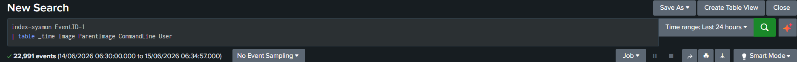
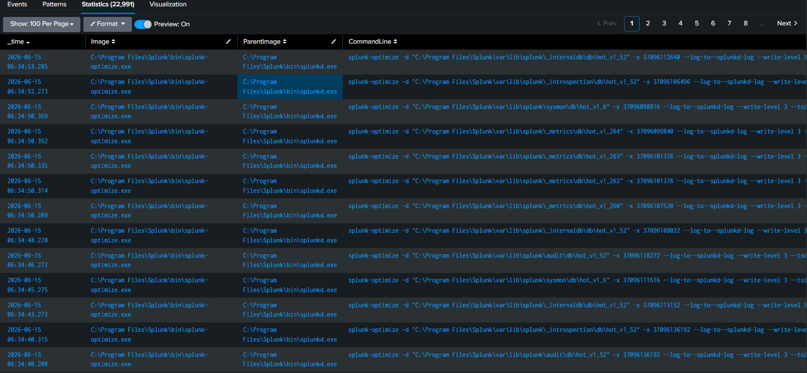
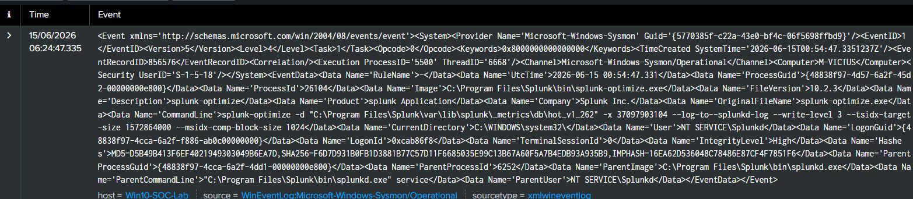
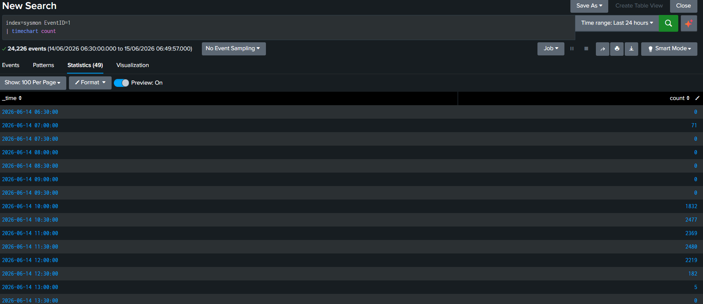

# Threat Hunting Case Study 01 – Process Creation Hunting

---

## 1. Overview

Process creation events provide some of the most valuable telemetry available to defenders. By monitoring process execution, analysts can reconstruct attacker activity, identify suspicious behavior, and understand parent-child process relationships.

This case study demonstrates how Sysmon Event ID 1 can be leveraged to hunt for process execution activity and establish a foundation for advanced investigations.

---

## 2. Objective

The objective of this hunt is to analyze process creation activity and collect contextual information including:

* Process Name
* Parent Process
* User Account
* Hostname
* Command Line
* Execution Time

Understanding these attributes enables defenders to identify suspicious execution patterns and investigate potential malicious activity.

---

## 3. Data Source

### Sysmon

Event ID:

```text
1 - Process Creation
```

---

## 4. Hunting Hypothesis

Attackers frequently execute commands and tools during various stages of an intrusion.

By analyzing process creation events, defenders can identify:

* Command execution
* PowerShell activity
* LOLBins usage
* Script execution
* Post-exploitation behavior
* Suspicious parent-child relationships

---

## 5. SPL Query

```spl
index=*
EventCode=1
| table _time Computer User Image ParentImage CommandLine
```

---

## 6. Event Fields Investigated

The following fields were analyzed:

| Field       | Description       |
| ----------- | ----------------- |
| _time       | Event timestamp   |
| Computer    | Hostname          |
| User        | User account      |
| Image       | Executed process  |
| ParentImage | Parent process    |
| CommandLine | Full command line |

---

## 7. Investigation Methodology

### Step 1 – Identify Executed Processes

Review:

* powershell.exe
* cmd.exe
* notepad.exe
* explorer.exe

and determine whether execution is expected.

---

### Step 2 – Analyze Parent Process

Examples:

Normal:

```text
explorer.exe → powershell.exe
```

Potentially Suspicious:

```text
WINWORD.EXE → powershell.exe
```

---

### Step 3 – Review Command Line

Examine command arguments for:

* Encoded commands
* DownloadString
* Invoke-WebRequest
* Suspicious scripts

---

### Step 4 – Review User Context

Determine:

* Interactive user
* Administrator account
* Service account

---

### Step 5 – Establish Event Timeline

Correlate process execution with other activity to understand the sequence of events.

---

## 8. Threat Hunting Opportunities

Process creation telemetry can help identify:

* PowerShell Empire
* Cobalt Strike
* Meterpreter
* Living-off-the-Land techniques
* Persistence mechanisms
* Malware execution
* Script-based attacks

---

## 9. MITRE ATT&CK Mapping

| Tactic    | Technique                         | ID        |
| --------- | --------------------------------- | --------- |
| Execution | Command and Scripting Interpreter | T1059     |
| Execution | PowerShell                        | T1059.001 |

---

## 10. Findings

Sysmon Event ID 1 provided detailed visibility into process execution activity.

The following information was successfully collected:

* Timestamp
* Hostname
* User
* Process Name
* Parent Process
* Command Line

This telemetry enables analysts to perform threat hunting and investigate suspicious activity effectively.

---

## 11. Conclusion

Process creation events are among the most important telemetry sources for defenders.

Monitoring Sysmon Event ID 1 enables analysts to understand attacker behavior, reconstruct activity, and identify suspicious execution patterns.

Process analysis forms the foundation for detection engineering, threat hunting, and incident response.

---

## 12. Supporting Evidence

### SPL Query



---

### Search Results



---

### Raw Event Analysis



---

### Timeline Analysis



