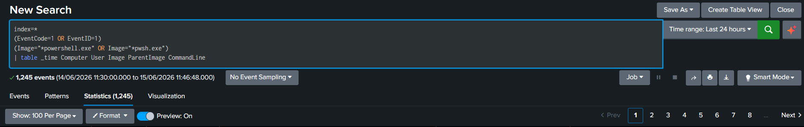
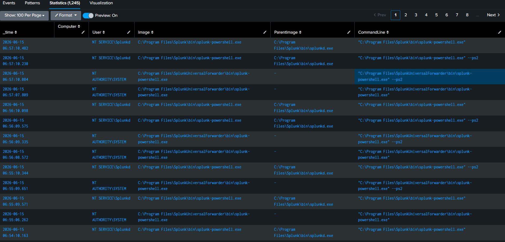
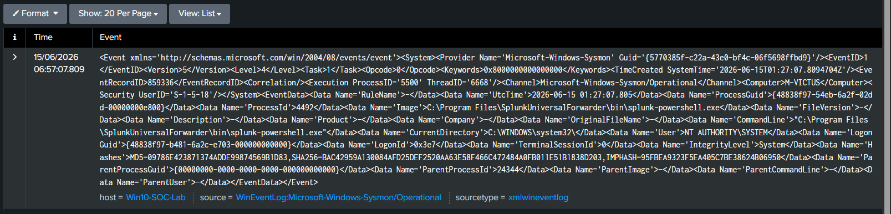
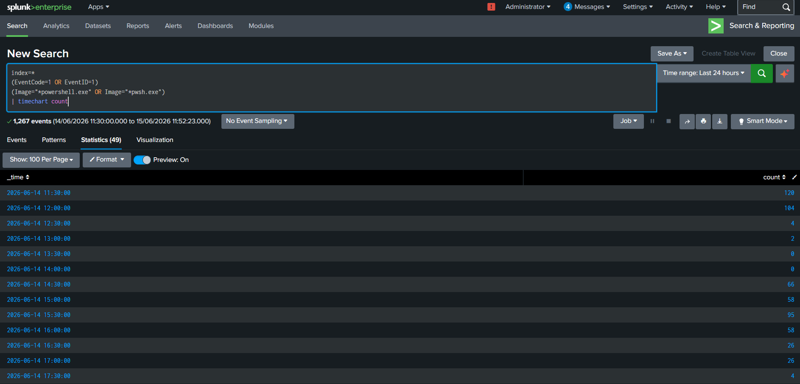

# Threat Hunting Case Study 02 – PowerShell Hunting

---

## 1. Overview

PowerShell is a legitimate administrative and automation framework extensively used in Windows environments. Due to its flexibility and powerful scripting capabilities, PowerShell is frequently abused by adversaries for execution, reconnaissance, payload delivery, persistence, and post-exploitation activities.

Monitoring PowerShell activity provides defenders with valuable visibility into attacker behavior and enables the detection of Living-off-the-Land techniques.

---

## 2. Objective

The objective of this hunt is to identify PowerShell execution activity and collect contextual information including:

- Process Name
- Parent Process
- User Account
- Hostname
- Command Line
- Execution Time

Analyzing these attributes enables defenders to distinguish legitimate administrative activity from suspicious behavior.

---

## 3. Data Source

### Sysmon

Event ID:

```text
1 - Process Creation
```

---

## 4. Hunting Hypothesis

Adversaries frequently abuse PowerShell to perform:

- Reconnaissance
- Payload delivery
- Script execution
- Persistence
- Credential access
- Post-exploitation activities

Monitoring PowerShell execution can help identify malicious behavior and provide valuable context during investigations.

---

## 5. SPL Query

```spl
index=*
EventCode=1
(Image="*powershell.exe" OR Image="*pwsh.exe")
| table _time Computer User Image ParentImage CommandLine
```

---

## 6. Event Fields Investigated

The following fields were analyzed:

| Field | Description |
|---------|------------|
| _time | Event timestamp |
| Computer | Hostname |
| User | User account |
| Image | Executed process |
| ParentImage | Parent process |
| CommandLine | Full command line |

---

## 7. Investigation Methodology

### Step 1 – Identify PowerShell Execution

Review:

- powershell.exe
- pwsh.exe

and determine whether execution is expected.

---

### Step 2 – Analyze Parent Process

Normal examples:

```text
explorer.exe → powershell.exe
cmd.exe → powershell.exe
```

Potentially suspicious examples:

```text
WINWORD.EXE → powershell.exe
EXCEL.EXE → powershell.exe
OUTLOOK.EXE → powershell.exe
mshta.exe → powershell.exe
```

---

### Step 3 – Examine Command Line

Look for:

- -enc
- -EncodedCommand
- Invoke-WebRequest
- DownloadString
- Invoke-Expression
- IEX
- FromBase64String

---

### Step 4 – Review User Context

Determine:

- Interactive user
- Administrator account
- Service account

Unexpected users executing PowerShell should be investigated further.

---

### Step 5 – Establish Timeline

Correlate PowerShell activity with surrounding events to understand the sequence of actions.

---

## 8. Threat Hunting Opportunities

PowerShell telemetry can help identify:

- PowerShell Empire
- Cobalt Strike
- Meterpreter
- Fileless malware
- Living-off-the-Land techniques
- Post-exploitation activity

---

## 9. MITRE ATT&CK Mapping

| Tactic | Technique | ID |
|----------|-----------|----|
| Execution | Command and Scripting Interpreter | T1059 |
| Execution | PowerShell | T1059.001 |

---

## 10. Findings

PowerShell execution events provided detailed visibility into:

- Execution time
- Hostname
- User account
- Parent process
- Full command line

This telemetry enables defenders to investigate suspicious PowerShell activity effectively.

---

## 11. Conclusion

PowerShell remains one of the most abused Windows utilities. Monitoring PowerShell execution enables analysts to identify suspicious behavior, reconstruct attacker activity, and detect Living-off-the-Land techniques.

PowerShell telemetry is essential for detection engineering, threat hunting, and incident response operations.

---

## 12. Supporting Evidence

### SPL Query



---

### Search Results



---

### Raw Event Analysis



---

### Timeline Analysis

