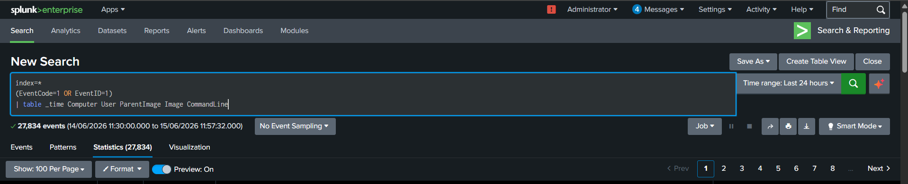
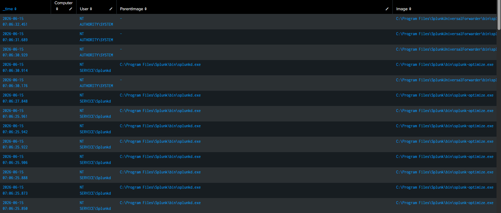
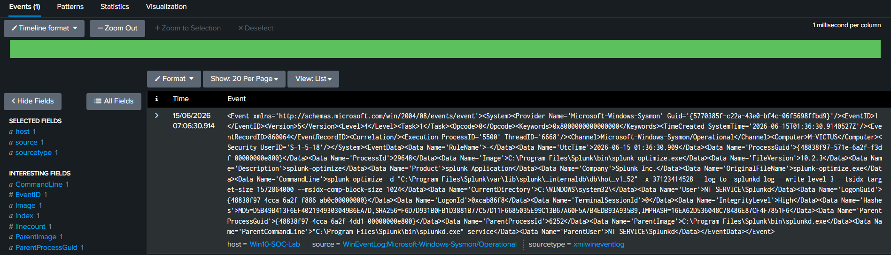
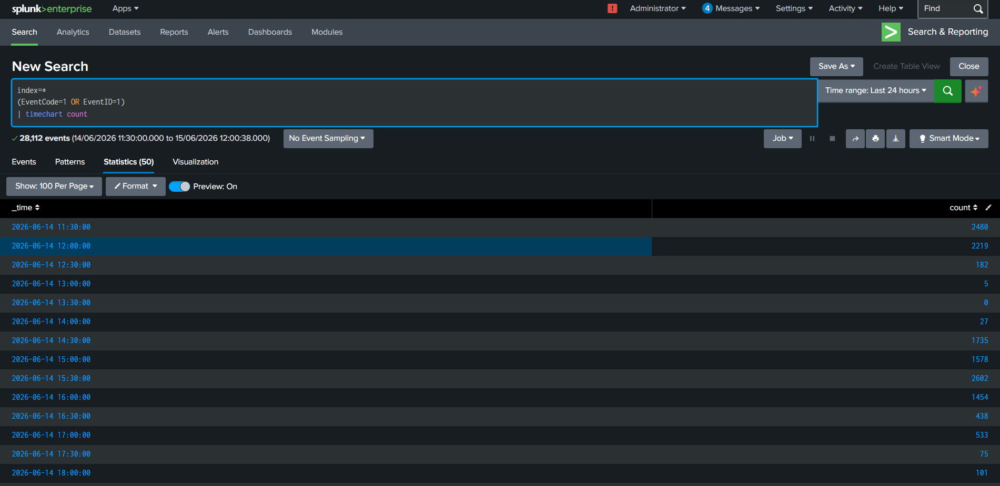

# Threat Hunting Case Study 03 – Parent-Child Process Analysis

---

## 1. Overview

Process relationships provide critical visibility into attacker behavior. By examining parent-child process chains, defenders can identify suspicious execution patterns and detect Living-off-the-Land techniques.

Parent-child analysis is fundamental to threat hunting, detection engineering, and incident response.

---

## 2. Objective

The objective of this hunt is to analyze process relationships and identify:

- Parent Process
- Child Process
- User Account
- Hostname
- Command Line
- Execution Time

Understanding these relationships enables analysts to distinguish normal process execution from suspicious behavior.

---

## 3. Data Source

### Sysmon

Event ID:

```text
1 - Process Creation
```

---

## 4. Hunting Hypothesis

Adversaries often abuse trusted applications to launch malicious processes.

Suspicious process chains may indicate:

- Initial Access
- Command Execution
- Payload Delivery
- Living-off-the-Land activity
- Post-Exploitation

---

## 5. SPL Query

```spl
index=*
(EventCode=1 OR EventID=1)
| table _time Computer User ParentImage Image CommandLine
```

---

## 6. Event Fields Investigated

| Field | Description |
|---------|------------|
| _time | Event timestamp |
| Computer | Hostname |
| User | User account |
| ParentImage | Parent process |
| Image | Child process |
| CommandLine | Full command line |

---

## 7. Investigation Methodology

### Step 1 – Identify Parent Processes

Common parent processes:

- explorer.exe
- cmd.exe
- powershell.exe
- services.exe

---

### Step 2 – Review Child Processes

Examples:

Normal:

```text
explorer.exe → notepad.exe

explorer.exe → calc.exe

powershell.exe → whoami.exe
```

Potentially Suspicious:

```text
WINWORD.EXE → powershell.exe

powershell.exe → certutil.exe

cmd.exe → regsvr32.exe

mshta.exe → powershell.exe
```

---

### Step 3 – Examine Command Lines

Review command arguments for:

- DownloadString
- Invoke-WebRequest
- Encoded commands
- LOLBins

---

### Step 4 – Review User Context

Determine:

- Interactive users
- Service accounts
- Administrator accounts

---

### Step 5 – Build Timeline

Correlate events to understand process execution sequences.

---

## 8. Threat Hunting Opportunities

Parent-child relationships can help identify:

- PowerShell Empire
- Cobalt Strike
- Meterpreter
- Fileless malware
- LOLBins
- Script execution
- Persistence mechanisms

---

## 9. MITRE ATT&CK Mapping

| Tactic | Technique | ID |
|----------|-----------|----|
| Execution | Command and Scripting Interpreter | T1059 |
| Defense Evasion | Signed Binary Proxy Execution | T1218 |

---

## 10. Findings

Process creation telemetry provided visibility into:

- Parent processes
- Child processes
- User context
- Command lines
- Event timelines

This information enables analysts to detect suspicious execution chains effectively.

---

## 11. Conclusion

Parent-child process analysis is a foundational skill for SOC analysts and threat hunters.

Monitoring process relationships enables defenders to identify attacker behavior and investigate suspicious execution patterns.

---

## 12. Supporting Evidence

### SPL Query



---

### Search Results



---

### Raw Event Analysis



---

### Timeline Analysis

