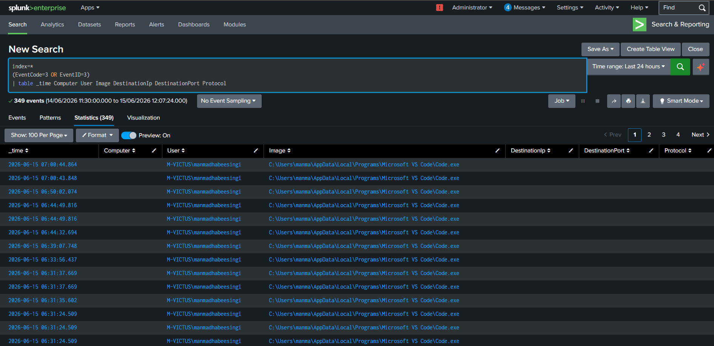
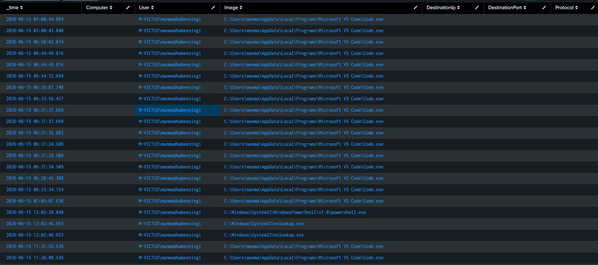
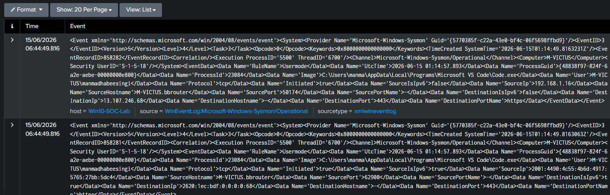
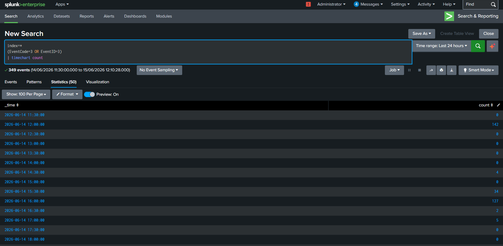

# Threat Hunting Case Study 04 – Network Connection Hunting

---

## 1. Overview

Network connections provide valuable visibility into communication between hosts and external systems. Monitoring network activity enables defenders to identify suspicious connections, command-and-control traffic, and attacker behavior.

Sysmon Event ID 3 captures network connections initiated by processes and provides context that can assist in threat hunting and incident response.

---

## 2. Objective

The objective of this hunt is to analyze network connections and collect:

- Source Host
- User Account
- Process Name
- Destination IP Address
- Destination Port
- Protocol
- Execution Time

Understanding network activity enables defenders to detect suspicious communication patterns and investigate potential threats.

---

## 3. Data Source

### Sysmon

Event ID:

```text
3 - Network Connection
```

---

## 4. Hunting Hypothesis

Adversaries frequently establish network connections to:

- Download payloads
- Communicate with command-and-control servers
- Perform reconnaissance
- Transfer data
- Maintain persistence

Monitoring network connections provides visibility into these activities.

---

## 5. SPL Query

```spl
index=*
(EventCode=3 OR EventID=3)
| table _time Computer User Image DestinationIp DestinationPort Protocol
```

---

## 6. Event Fields Investigated

| Field | Description |
|---------|------------|
| _time | Event timestamp |
| Computer | Hostname |
| User | User account |
| Image | Process name |
| DestinationIp | Remote IP address |
| DestinationPort | Destination port |
| Protocol | Network protocol |

---

## 7. Investigation Methodology

### Step 1 – Identify Initiating Process

Review:

- powershell.exe
- chrome.exe
- firefox.exe
- svchost.exe
- cmd.exe

---

### Step 2 – Analyze Destination IP

Determine:

- Internal address
- External address
- Known trusted service
- Unknown destination

---

### Step 3 – Review Port Usage

Common ports:

- 80
- 443
- 53
- 3389
- 445

Unusual ports should be investigated.

---

### Step 4 – Review User Context

Determine:

- Interactive user
- Service account
- Administrator account

---

### Step 5 – Correlate Events

Associate network activity with:

- Process creation
- PowerShell execution
- Persistence mechanisms

---

## 8. Threat Hunting Opportunities

Network telemetry can help identify:

- Command and Control activity
- Malware communication
- Beaconing behavior
- PowerShell download activity
- Data exfiltration
- Lateral movement

---

## 9. MITRE ATT&CK Mapping

| Tactic | Technique | ID |
|----------|-----------|----|
| Command and Control | Application Layer Protocol | T1071 |
| Exfiltration | Exfiltration Over C2 Channel | T1041 |

---

## 10. Findings

Network connection telemetry provided visibility into:

- Process activity
- Destination IP addresses
- Port usage
- User context
- Communication patterns

This information assists analysts in identifying suspicious network behavior.

---

## 11. Conclusion

Network connection analysis is an essential skill for SOC analysts and threat hunters.

Monitoring Sysmon Event ID 3 enables defenders to investigate suspicious communications and detect attacker behavior effectively.

---

## 12. Supporting Evidence

### SPL Query



---

### Search Results



---

### Raw Event Analysis



---

### Timeline Analysis

s