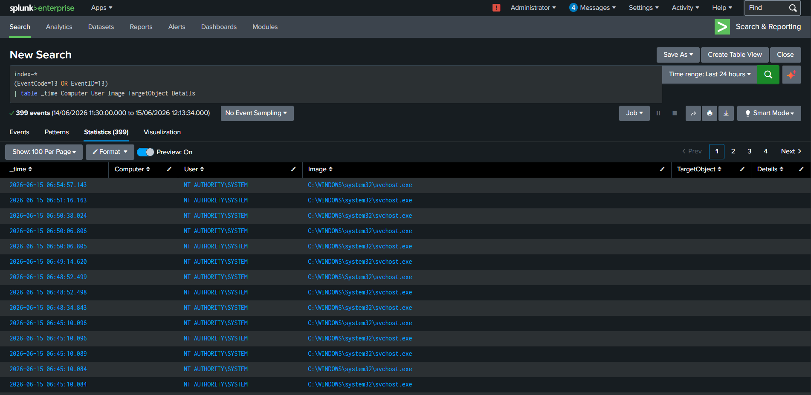
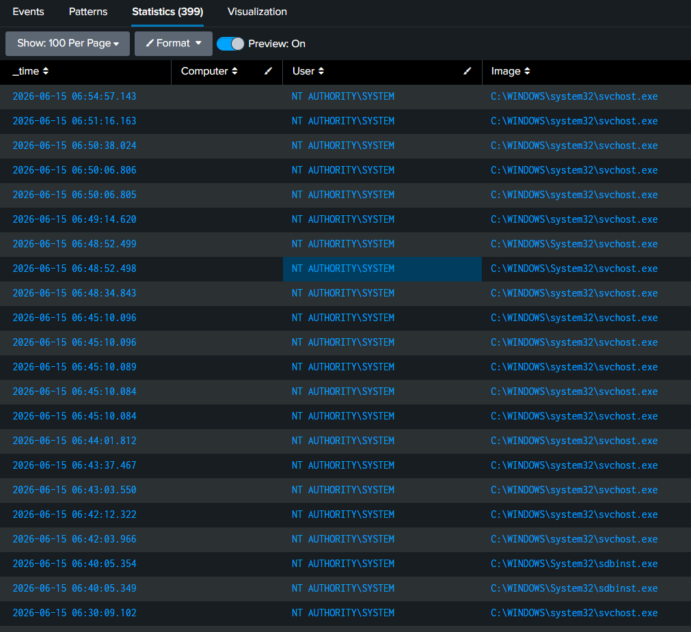
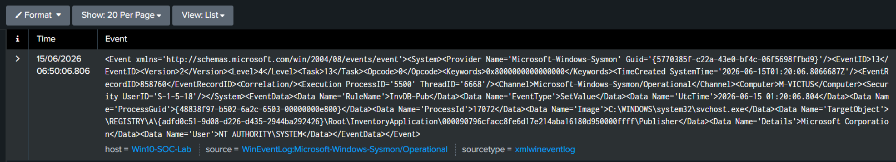
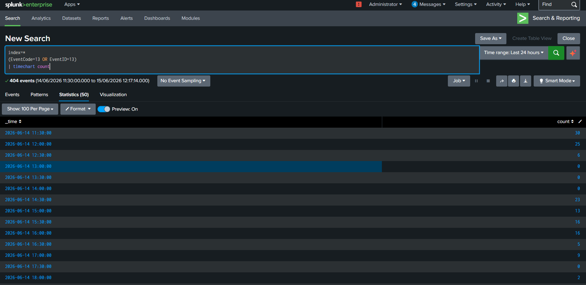

# Threat Hunting Case Study 05 – Registry Persistence Hunting

---

## 1. Overview

The Windows Registry is frequently abused by adversaries to establish persistence and maintain access to compromised systems.

Monitoring registry modifications enables defenders to identify persistence mechanisms and investigate attacker activity.

Sysmon Event ID 13 provides visibility into registry value modifications and assists in threat hunting and incident response.

---

## 2. Objective

The objective of this hunt is to analyze registry modifications and collect:

- Hostname
- User Account
- Process Name
- Target Registry Key
- Registry Value
- Execution Time

Understanding registry activity enables defenders to detect persistence mechanisms and investigate suspicious modifications.

---

## 3. Data Source

### Sysmon

Event ID:

```text
13 - Registry Value Set
```

---

## 4. Hunting Hypothesis

Adversaries commonly modify registry keys to:

- Establish persistence
- Execute malware at startup
- Maintain long-term access
- Evade detection

Monitoring registry modifications provides visibility into these techniques.

---

## 5. SPL Query

```spl
index=*
(EventCode=13 OR EventID=13)
| table _time Computer User Image TargetObject Details
```

---

## 6. Event Fields Investigated

| Field | Description |
|---------|------------|
| _time | Event timestamp |
| Computer | Hostname |
| User | User account |
| Image | Process name |
| TargetObject | Registry key |
| Details | Registry value |

---

## 7. Investigation Methodology

### Step 1 – Review Process

Identify which process modified the registry.

Examples:

- powershell.exe
- reg.exe
- cmd.exe
- explorer.exe

---

### Step 2 – Examine Registry Path

Pay special attention to:

```text
HKCU\Software\Microsoft\Windows\CurrentVersion\Run

HKLM\Software\Microsoft\Windows\CurrentVersion\Run

HKCU\Software\Microsoft\Windows\CurrentVersion\RunOnce

HKLM\Software\Microsoft\Windows\CurrentVersion\RunOnce
```

These locations are frequently abused for persistence.

---

### Step 3 – Review Registry Value

Look for:

- Executables
- Scripts
- Encoded commands
- PowerShell references

---

### Step 4 – Review User Context

Determine:

- Interactive user
- Administrator account
- Service account

---

### Step 5 – Correlate Related Events

Associate registry modifications with:

- Process creation
- PowerShell execution
- Network activity

---

## 8. Threat Hunting Opportunities

Registry telemetry can help identify:

- Persistence mechanisms
- Malware installation
- PowerShell abuse
- Startup modifications
- Living-off-the-Land techniques

---

## 9. MITRE ATT&CK Mapping

| Tactic | Technique | ID |
|----------|-----------|----|
| Persistence | Registry Run Keys / Startup Folder | T1547.001 |

---

## 10. Findings

Registry telemetry provided visibility into:

- Registry modifications
- Process activity
- User context
- Persistence mechanisms

This information assists analysts in detecting attacker persistence.

---

## 11. Conclusion

Registry monitoring is essential for detecting persistence mechanisms.

Sysmon Event ID 13 enables defenders to identify suspicious registry modifications and investigate attacker behavior effectively.

---

## 12. Supporting Evidence

### SPL Query



---

### Search Results



---

### Raw Event Analysis



---

### Timeline Analysis

