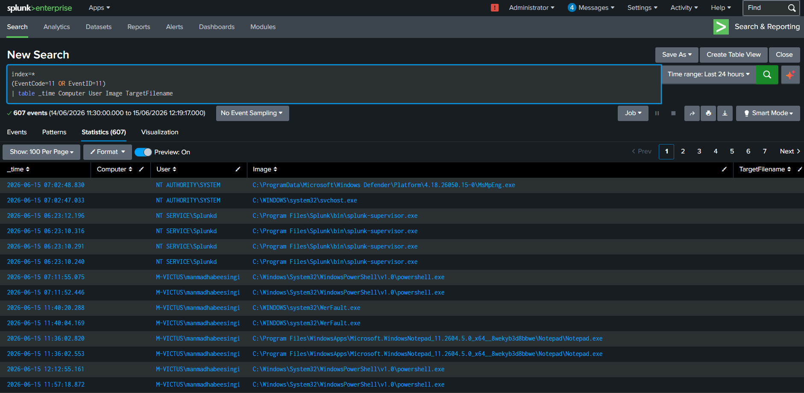
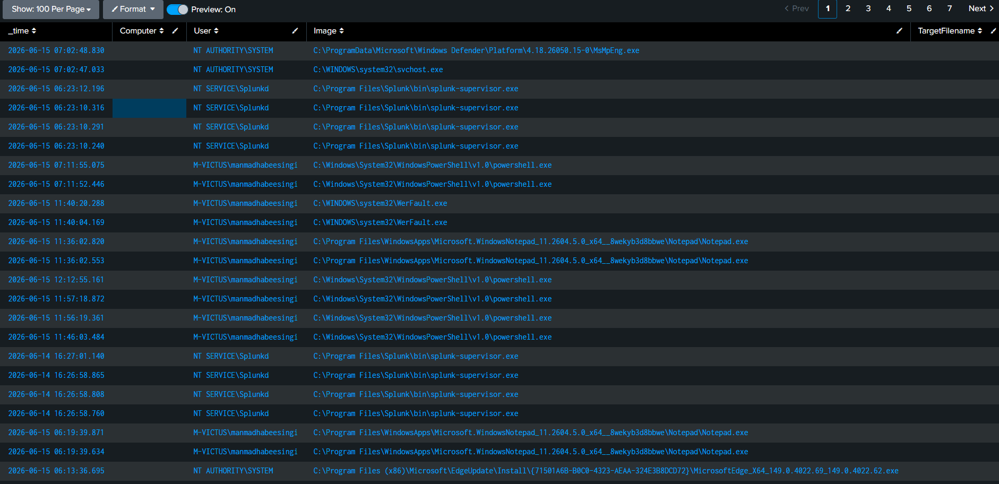
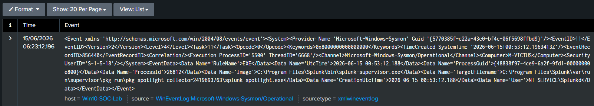
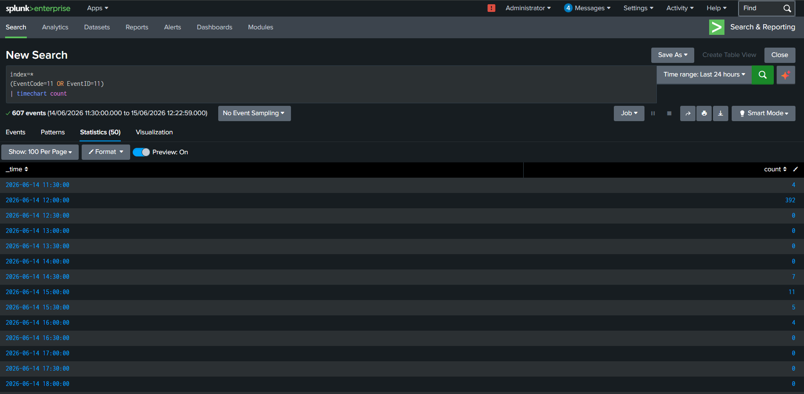

# Threat Hunting Case Study 06 – File Creation Hunting

---

## 1. Overview

File creation events provide valuable visibility into attacker activity and malware behavior. Monitoring file creation enables defenders to identify payload delivery, malware execution, persistence mechanisms, and ransomware-related activity.

Sysmon Event ID 11 captures file creation events and assists defenders in threat hunting and incident response.

---

## 2. Objective

The objective of this hunt is to analyze file creation activity and collect:

- Hostname
- User Account
- Process Name
- Target File
- Execution Time

Understanding file creation behavior enables defenders to investigate suspicious activity and identify potential threats.

---

## 3. Data Source

### Sysmon

Event ID:

```text
11 - File Create
```

---

## 4. Hunting Hypothesis

Adversaries frequently create files to:

- Deliver malware
- Store payloads
- Establish persistence
- Execute scripts
- Stage ransomware operations

Monitoring file creation provides visibility into these activities.

---

## 5. SPL Query

```spl
index=*
(EventCode=11 OR EventID=11)
| table _time Computer User Image TargetFilename
```

---

## 6. Event Fields Investigated

| Field | Description |
|---------|------------|
| _time | Event timestamp |
| Computer | Hostname |
| User | User account |
| Image | Process name |
| TargetFilename | Created file |

---

## 7. Investigation Methodology

### Step 1 – Identify the Process

Determine which process created the file.

Examples:

- powershell.exe
- cmd.exe
- explorer.exe
- notepad.exe

---

### Step 2 – Review File Location

Pay attention to:

```text
C:\Users\<User>\Desktop

C:\Users\<User>\Downloads

C:\Temp

C:\ProgramData

AppData\Roaming

Startup folders
```

---

### Step 3 – Examine File Type

Look for:

- .exe
- .dll
- .bat
- .ps1
- .vbs
- .zip

---

### Step 4 – Review User Context

Determine:

- Interactive user
- Administrator account
- Service account

---

### Step 5 – Correlate Related Events

Associate file creation activity with:

- Process creation
- PowerShell execution
- Network connections
- Registry modifications

---

## 8. Threat Hunting Opportunities

File creation telemetry can help identify:

- Malware delivery
- Ransomware activity
- Persistence mechanisms
- Payload staging
- Script execution

---

## 9. MITRE ATT&CK Mapping

| Tactic | Technique | ID |
|----------|-----------|----|
| Execution | User Execution | T1204 |
| Persistence | Boot or Logon Autostart Execution | T1547 |

---

## 10. Findings

File creation telemetry provided visibility into:

- Created files
- Process activity
- User context
- File locations

This information enables analysts to identify suspicious file activity and investigate attacker behavior.

---

## 11. Conclusion

File creation monitoring is essential for malware analysis, ransomware investigations, and incident response.

Sysmon Event ID 11 provides valuable visibility into file activity and enables defenders to detect suspicious behavior effectively.

---

## 12. Supporting Evidence

### SPL Query



---

### Search Results



---

### Raw Event Analysis



---

### Timeline Analysis

