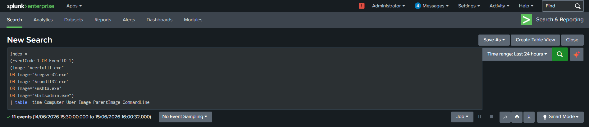
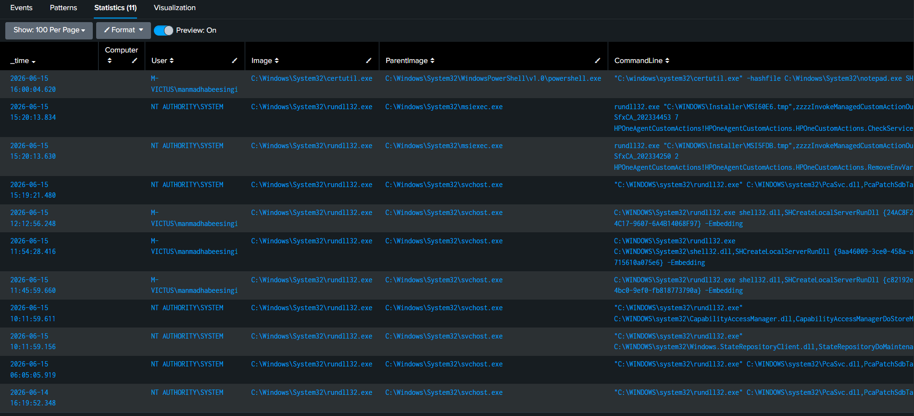
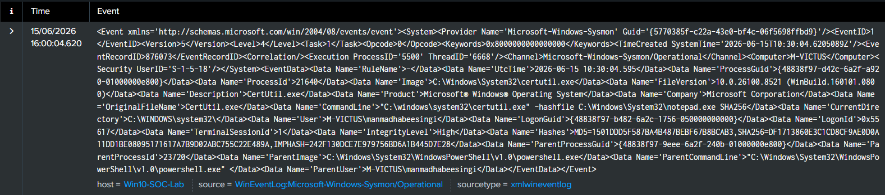
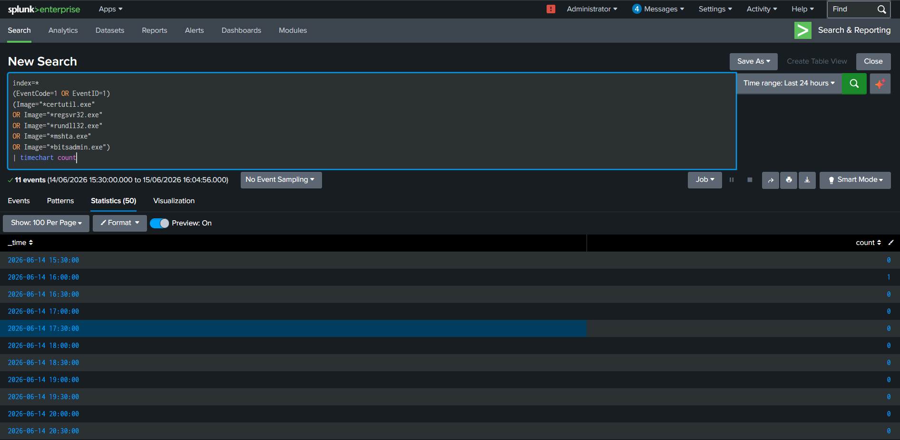

# Threat Hunting Case Study 07 – Living-Off-The-Land Binaries (LOLBins) Hunting

---

## 1. Overview

Living-Off-The-Land Binaries (LOLBins) are legitimate Windows utilities frequently abused by adversaries to evade detection and execute malicious actions.

Because these binaries are signed and trusted, they are commonly used in fileless attacks and post-exploitation activities.

Monitoring LOLBins usage provides defenders with valuable visibility into attacker behavior.

---

## 2. Objective

The objective of this hunt is to identify suspicious execution of legitimate Windows binaries and collect:

- Hostname
- User Account
- Process Name
- Parent Process
- Command Line
- Execution Time

---

## 3. Data Source

### Sysmon

Event ID:

```text
1 - Process Creation
```

---

## 4. Hunting Hypothesis

Adversaries frequently abuse legitimate binaries to:

- Download payloads
- Execute scripts
- Evade defenses
- Perform persistence
- Maintain command and control

Monitoring these binaries enables defenders to identify attacker activity.

---

## 5. Target LOLBins

The following binaries were investigated:

```text
certutil.exe

regsvr32.exe

rundll32.exe

mshta.exe

bitsadmin.exe
```

---

## 6. SPL Query

```spl
index=*
(EventCode=1 OR EventID=1)
(Image="*certutil.exe"
OR Image="*regsvr32.exe"
OR Image="*rundll32.exe"
OR Image="*mshta.exe"
OR Image="*bitsadmin.exe")
| table _time Computer User Image ParentImage CommandLine
```

---

## 7. Event Fields Investigated

| Field | Description |
|---------|------------|
| _time | Timestamp |
| Computer | Hostname |
| User | User account |
| Image | Process name |
| ParentImage | Parent process |
| CommandLine | Full command line |

---

## 8. Investigation Methodology

### Step 1 – Identify LOLBin Execution

Review:

- certutil.exe
- regsvr32.exe
- rundll32.exe
- mshta.exe
- bitsadmin.exe

---

### Step 2 – Examine Parent Process

Normal:

```text
explorer.exe → certutil.exe
```

Suspicious:

```text
powershell.exe → certutil.exe

WINWORD.EXE → mshta.exe

cmd.exe → rundll32.exe
```

---

### Step 3 – Review Command Line

Look for:

- URLs
- Download activity
- Scripts
- DLL execution

---

### Step 4 – Review User Context

Determine:

- Interactive user
- Administrator account
- Service account

---

### Step 5 – Correlate Events

Associate LOLBin execution with:

- PowerShell activity
- Network connections
- File creation
- Persistence mechanisms

---

## 9. MITRE ATT&CK Mapping

| Tactic | Technique | ID |
|---------|-----------|----|
| Defense Evasion | Signed Binary Proxy Execution | T1218 |
| Execution | Command and Scripting Interpreter | T1059 |

---

## 10. False Positives

Legitimate administrative activity may trigger these events.

Examples:

- Software installation
- System maintenance
- Administrative scripts

---

## 11. Findings

LOLBins execution telemetry provided visibility into:

- Process activity
- Parent-child relationships
- User context
- Command lines

This information enables analysts to identify suspicious use of trusted binaries.

---

## 12. Conclusion

Monitoring LOLBins is essential for detecting fileless malware and post-exploitation techniques.

Process creation telemetry enables defenders to investigate attacker behavior and identify abuse of trusted binaries.

---

## 13. Supporting Evidence

### SPL Query



---

### Search Results



---

### Raw Event Analysis



---

### Timeline Analysis

