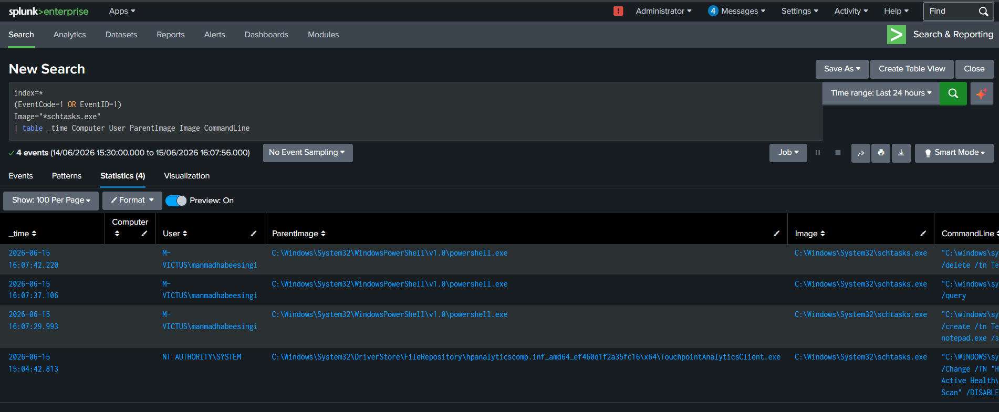
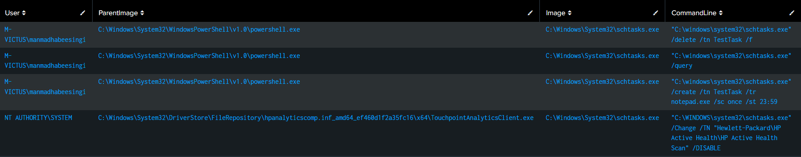
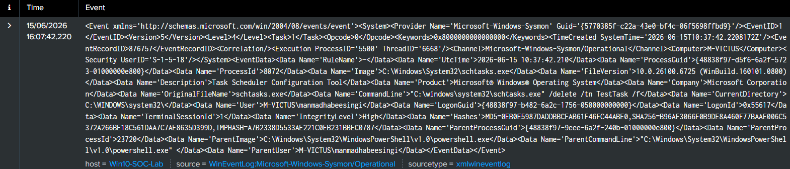
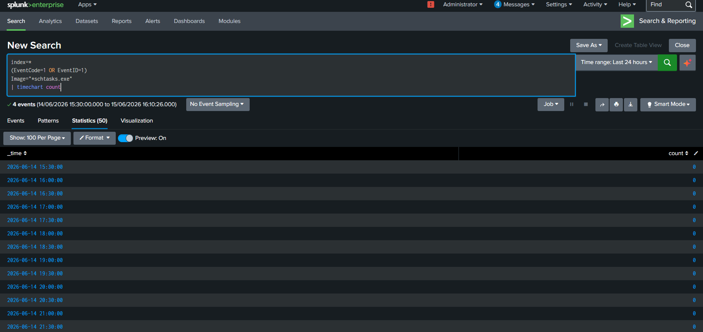

# Threat Hunting Case Study 08 – Scheduled Task Abuse

---

## 1. Overview

Scheduled tasks are commonly used by administrators for automation purposes. However, adversaries frequently abuse scheduled tasks to establish persistence, execute malicious payloads, and maintain access to compromised systems.

Monitoring scheduled task activity provides defenders with valuable visibility into attacker behavior and persistence mechanisms.

---

## 2. Objective

The objective of this hunt is to identify scheduled task creation and execution activity and collect:

- Hostname
- User Account
- Process Name
- Parent Process
- Command Line
- Execution Time

---

## 3. Data Source

### Sysmon

Event ID:

```text
1 - Process Creation
```

---

## 4. Hunting Hypothesis

Adversaries frequently create scheduled tasks to:

- Maintain persistence
- Execute malware
- Launch payloads
- Evade detection

Monitoring scheduled task activity enables defenders to detect attacker techniques and investigate suspicious behavior.

---

## 5. SPL Query

```spl
index=*
(EventCode=1 OR EventID=1)
Image="*schtasks.exe"
| table _time Computer User ParentImage Image CommandLine
```

---

## 6. Event Fields Investigated

| Field | Description |
|---------|------------|
| _time | Timestamp |
| Computer | Hostname |
| User | User account |
| ParentImage | Parent process |
| Image | Process name |
| CommandLine | Full command line |

---

## 7. Investigation Methodology

### Step 1 – Identify schtasks.exe Execution

Review:

```text
schtasks.exe
```

---

### Step 2 – Examine Parent Process

Normal:

```text
explorer.exe → schtasks.exe
```

Suspicious:

```text
powershell.exe → schtasks.exe

cmd.exe → schtasks.exe
```

---

### Step 3 – Review Command Line

Look for:

- /create
- /tn
- /tr
- Hidden payloads
- PowerShell commands

---

### Step 4 – Review User Context

Determine:

- Interactive user
- Administrator account
- Service account

---

### Step 5 – Correlate Events

Associate scheduled task activity with:

- PowerShell execution
- Network connections
- File creation
- Registry modifications

---

## 8. Threat Hunting Opportunities

Scheduled task telemetry can help identify:

- Malware persistence
- Post-exploitation
- Payload execution
- Living-off-the-Land techniques

---

## 9. MITRE ATT&CK Mapping

| Tactic | Technique | ID |
|---------|-----------|----|
| Persistence | Scheduled Task/Job | T1053.005 |

---

## 10. False Positives

Legitimate administrative activity may generate these events.

Examples:

- Software updates
- Backup operations
- Enterprise automation scripts

---

## 11. Findings

Scheduled task telemetry provided visibility into:

- Process activity
- Parent-child relationships
- User context
- Command lines

This information enables analysts to investigate persistence mechanisms effectively.

---

## 12. Conclusion

Monitoring scheduled task activity is essential for detecting attacker persistence and post-exploitation behavior.

Sysmon process creation events enable defenders to identify abuse of scheduled tasks and investigate malicious activity.

---

## 13. Supporting Evidence

### SPL Query



---

### Search Results



---

### Raw Event Analysis



---

### Timeline Analysis

