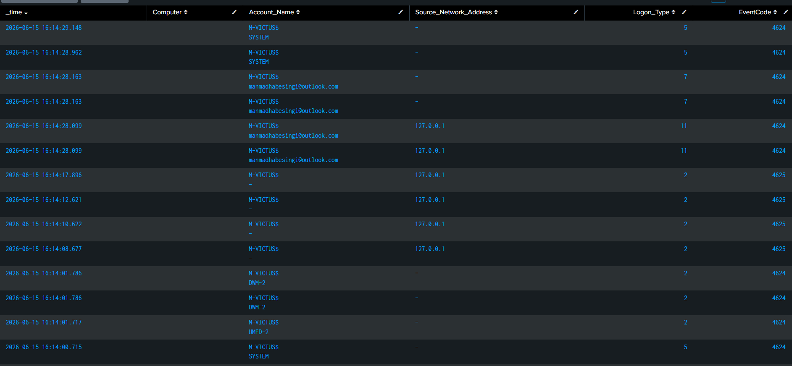
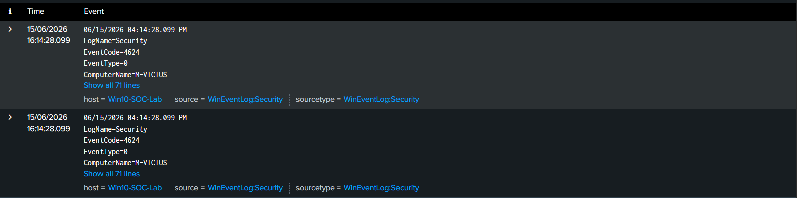
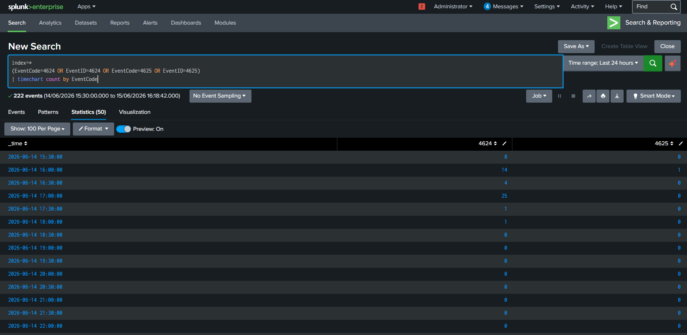

# Threat Hunting Case Study 09 – Authentication Investigation

---

## 1. Overview

Authentication events provide valuable visibility into user activity and access patterns. Monitoring successful and failed logon events enables defenders to detect suspicious account usage, brute force attempts, and unauthorized access.

Windows Security Events 4624 and 4625 are among the most important telemetry sources for SOC analysts and incident responders.

---

## 2. Objective

The objective of this hunt is to investigate authentication activity and collect:

- Username
- Hostname
- Source IP Address
- Logon Type
- Event Time

Understanding authentication behavior enables defenders to identify abnormal access patterns and investigate potential security incidents.

---

## 3. Data Source

### Windows Security Logs

Event IDs:

```text
4624 - Successful Logon

4625 - Failed Logon
```

---

## 4. Hunting Hypothesis

Adversaries frequently abuse accounts to:

- Gain initial access
- Perform brute force attacks
- Escalate privileges
- Maintain persistence

Monitoring authentication activity provides visibility into these techniques.

---

## 5. SPL Query

```spl
index=*
(EventCode=4624 OR EventID=4624 OR EventCode=4625 OR EventID=4625)
| table _time Computer Account_Name Source_Network_Address Logon_Type EventCode
```

---

## 6. Event Fields Investigated

| Field | Description |
|---------|------------|
| _time | Timestamp |
| Computer | Hostname |
| Account_Name | Username |
| Source_Network_Address | Source IP |
| Logon_Type | Logon Type |
| EventCode | Event ID |

---

## 7. Investigation Methodology

### Step 1 – Identify Logon Events

Review:

- 4624 (Successful Logon)
- 4625 (Failed Logon)

---

### Step 2 – Examine Username

Determine:

- Local account
- Domain account
- Administrator account

---

### Step 3 – Review Source IP

Identify:

- Internal IPs
- External IPs
- Unknown systems

---

### Step 4 – Analyze Logon Type

Common values:

- 2 → Interactive
- 3 → Network
- 10 → Remote Desktop

---

### Step 5 – Correlate Events

Associate authentication activity with:

- Process creation
- PowerShell execution
- Network connections

---

## 8. Threat Hunting Opportunities

Authentication telemetry can help identify:

- Brute force attacks
- Password spraying
- Unauthorized access
- Lateral movement
- Privilege escalation

---

## 9. MITRE ATT&CK Mapping

| Tactic | Technique | ID |
|---------|-----------|----|
| Credential Access | Brute Force | T1110 |
| Lateral Movement | Remote Services | T1021 |

---

## 10. False Positives

Legitimate activity may generate these events.

Examples:

- User logons
- Service accounts
- Scheduled tasks

---

## 11. Findings

Authentication telemetry provided visibility into:

- User activity
- Source addresses
- Logon types
- Successful and failed logons

This information enables analysts to investigate suspicious access activity effectively.

---

## 12. Conclusion

Authentication analysis is fundamental to SOC operations and incident response.

Monitoring Windows Security Events enables defenders to identify unauthorized access and investigate account activity.

---

## 13. Supporting Evidence

### SPL Query


---

### Search Results



---

### Raw Event Analysis



---

### Timeline Analysis

