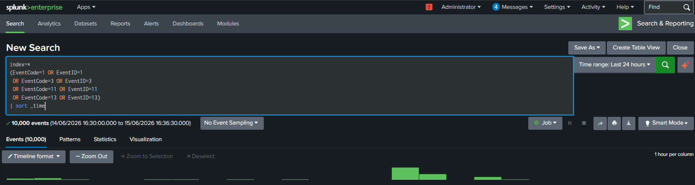
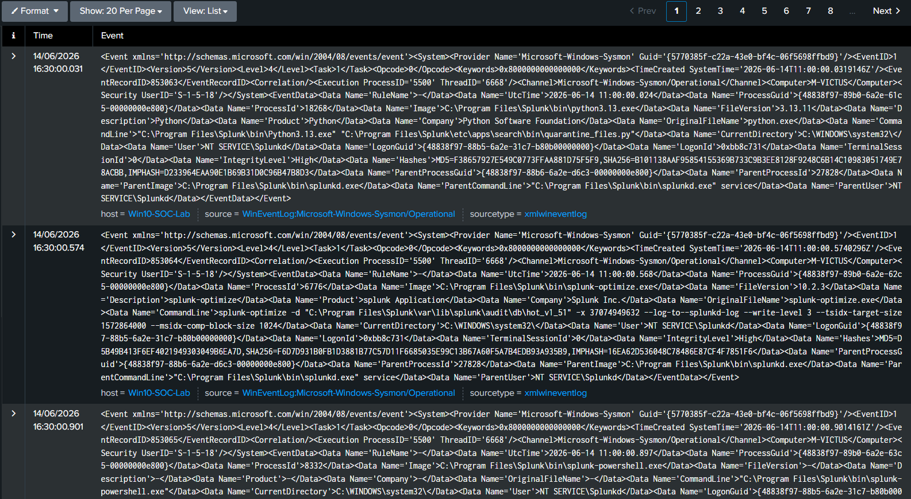
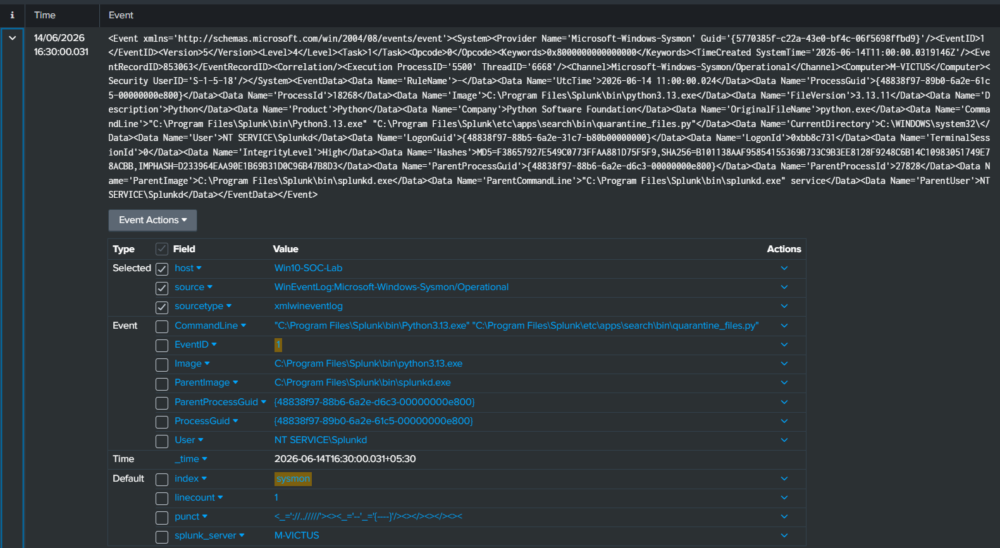
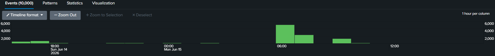

# Threat Hunting Case Study 10 – Timeline Reconstruction

---

## 1. Overview

Timeline reconstruction is one of the most important skills in incident response and threat hunting.

Rather than analyzing individual events in isolation, analysts correlate multiple event sources to reconstruct attacker behavior and understand the sequence of activity that occurred on a system.

This case study demonstrates how Sysmon telemetry can be correlated to create a timeline of events and identify suspicious activity.

---

## 2. Objective

The objective of this investigation is to correlate multiple event types and reconstruct activity across a system.

The following telemetry sources were analyzed:

- Process Creation
- Network Connections
- File Creation
- Registry Modifications

The goal is to understand how events relate to one another and establish an attack timeline.

---

## 3. Data Sources

### Sysmon Event IDs

```text
1  - Process Creation

3  - Network Connection

11 - File Creation

13 - Registry Value Set
```

---

## 4. Investigation Scenario

A user executes commands from PowerShell.

The process performs network activity, creates files on disk, and modifies the registry.

The objective is to reconstruct the sequence of events and determine whether the activity appears suspicious.

---

## 5. SPL Query

```spl
index=*
(EventCode=1 OR EventID=1
 OR EventCode=3 OR EventID=3
 OR EventCode=11 OR EventID=11
 OR EventCode=13 OR EventID=13)
| sort _time
| table _time Computer EventCode Image ParentImage CommandLine TargetFilename TargetObject DestinationIp DestinationPort
```

---

## 6. Investigation Methodology

### Step 1 – Review Process Creation

Identify:

- powershell.exe
- cmd.exe
- certutil.exe
- schtasks.exe

Determine what initiated activity.

---

### Step 2 – Review Network Activity

Analyze:

- Destination IP
- Destination Port
- Protocol

Determine whether communication appears normal.

---

### Step 3 – Review File Activity

Identify:

- New files
- Payload staging
- Suspicious file locations

Examples:

```text
Desktop

Downloads

Temp

AppData
```

---

### Step 4 – Review Registry Activity

Review:

```text
Run Keys

RunOnce Keys

Startup Locations
```

Determine whether persistence was established.

---

### Step 5 – Build Timeline

Correlate all events chronologically.

Example:

```text
PowerShell Execution

↓

Network Connection

↓

File Creation

↓

Registry Modification
```

---

## 7. MITRE ATT&CK Mapping

| Tactic | Technique | ID |
|----------|-----------|----|
| Execution | PowerShell | T1059.001 |
| Command and Control | Application Layer Protocol | T1071 |
| Persistence | Registry Run Keys | T1547.001 |
| Defense Evasion | Signed Binary Proxy Execution | T1218 |

---

## 8. False Positives

Legitimate administrative activity can generate similar events.

Examples:

- Software installation
- System administration
- Enterprise automation scripts

Analysts should review context before determining malicious intent.

---

## 9. Findings

Correlation of Sysmon telemetry provided visibility into:

- Process execution
- Network communication
- File creation
- Registry modifications

Timeline reconstruction enabled the identification of relationships between events and improved understanding of system activity.

---

## 10. Conclusion

Timeline reconstruction is a critical skill for threat hunters and incident responders.

By correlating multiple telemetry sources, defenders can reconstruct activity, investigate suspicious behavior, and understand attacker techniques more effectively.

This methodology forms the foundation of professional incident response investigations.

---

## 11. Supporting Evidence

### Timeline Query



---

### Correlated Events



---

### Event Correlation



---

### Visualization

